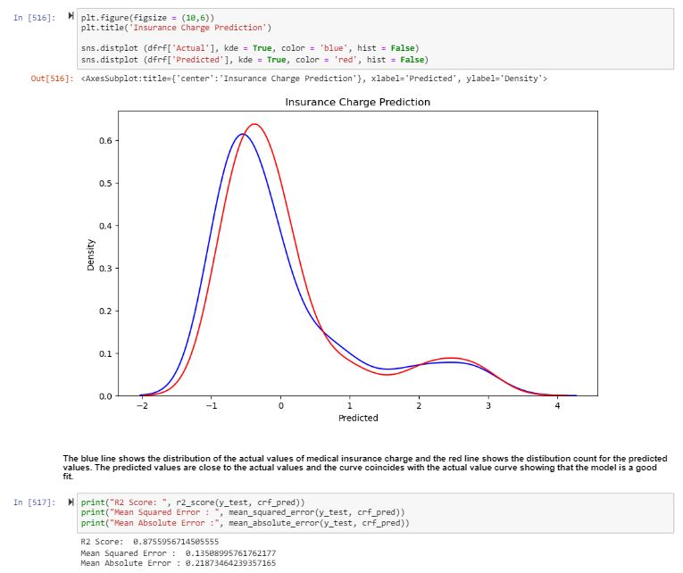

# Predicting-Medical-Insurance-Cost-of-Beneficiaries

For this project, several machine learning models were tested on the prediction of medical health insurance costs using Pandas and Scikit-Learn.

Models Used: Decision Tree Regressor, Random Forest Regressor, and Simple Linear Regression

About the project
The essence of the project lies in predicting the medical insurance premium costs of primary beneficiaries based on various attributes.

Through extensive exploratory data analysis, it has been ascertained that the medical insurance charge is notably influenced by key factors: smoker status, age, BMI, sex, children, and region.

Remarkably, smokers have higher health insurance rates because they are more susceptible to health issues and illnesses than non-smokers, such as lung infections, cancer, and other critical ailments. Smoking is typically considered a risk factor for various health problems across various countries. A distinct trend was uncovered wherein insurance charges exhibit a direct correlation with a smoker's smoking status and also with a beneficiary's increasing age. Notably, there was also a positive correlation with an increasing body mass index between 30 and 45 kg/m2.

In terms of machine learning, this project employed two regressor models—the Decision Tree Regressor and the Random Forest Regressor—to forecast insurance charges. Notably, the Decision Tree Regressor demonstrated remarkable performance, achieving an accuracy rate of 88.2%. The project integrates thorough data analysis with advanced predictive modeling to offer insights into health insurance costs and precise predictions of insurance charge amounts, thereby contributing to a more informed health insurance premium determination by health insurance companies after assessing beneficiaries lifestyle, medical history, BMI, and age.
